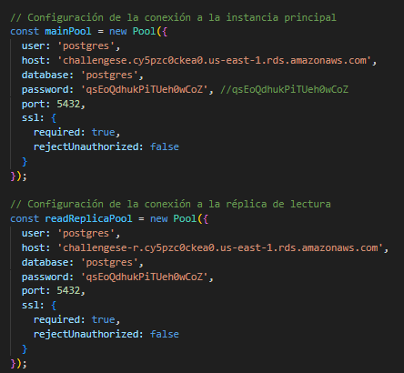
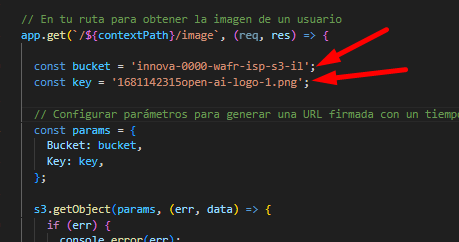
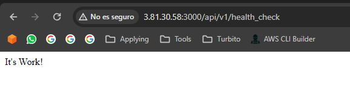

# Requisitos previos
## Instalar Node JS
Ejecutar los siguientes comandos en el servidor:
```shell
curl -o- https://raw.githubusercontent.com/nvm-sh/nvm/v0.39.7/install.sh | bash
source ~/.bashrc
nvm install --lts
node -e "console.log('Running Node.js ' + process.version)"
```
## Instalar librerías
Ubicarse en el directorio de la aplicación y ejecutar el siguiente comando:
```shell
npm install
```

## Configurar credenciales de BD, principal y read réplica.
En el archivo app.js, considerar el host, database, user, password.



## Configurar nombre de bucket y key de imagen
En el archivo app.js, agregar el nombre del bucket y la key de la imagen almacenada.



# Ejecutar Aplicación
Ejecutar el siguiente comando

```shell
node app.js
```

# Probar Aplicación
## Desde navegador:



## Con curl:

```shell
curl http://<IPSERVER>:3000/api/v1/health_check
```

## Endpoint disponibles
- Get: /image
- Get: /api/v1/user
- Post: /api/v1/user
  - Body: 
    ```json
            {
                "first_name": "Olly",
                "last_name": "Poveleye",
                "address": "66 Crownhardt Circle",
                "email": "opoveleye0@booking.com",
                "gender": "Non-binary",
                "ip_address": "35.118.113.201"
            } 
      ```